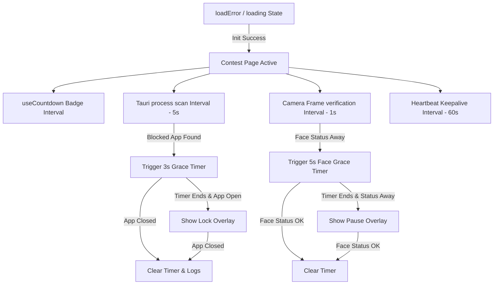

# AMS Access Contest Area: System Architecture & User Interface Analysis

This document provides a highly detailed breakdown of the AMS Access Contest Area interface (`client.tsx`), its layout panes, editor components, terminal surfaces, security/proctoring integrations, and underlying CSS/Tauri IPC mechanisms.

---

## 1. Executive Summary & Design Aesthetics

The AMS Access Contest Area is designed as a **terminal-grade, high-agency, dark-mode workspace**. It departs from soft consumer-style design patterns, adopting a structured, monochromatic grid interface reminiscent of a developer's desktop editor or a financial terminal.

### Key Visual & Architectural Principles

1. **Monochromatic & Low-Contrast Surfaces**: The UI uses a deep `#0F0F0F` background, paired with `#1F1F1F` borders. Text levels are carefully tiered from high-contrast white (`#ffffff`) for active items to muted slate colors (`#64748b`, `#475569`) for metadata.
2. **Monospace Typography**: All status displays, code widgets, line numbers, logs, timers, and editor panes use **JetBrains Mono** or **IBM Plex Mono** to enforce a raw, technical layout.
3. **Responsive Grid Layout**: Standard flexbox and CSS grids structure the three main panes, ensuring zero overlap, fixed vertical heights, and independent panel scrollbars.
4. **Performance & Security Isolation**: Sub-elements like the camera proctoring loops and Tauri-based process scanners operate in separate hooks and intervals, keeping the editing environment responsive.

---

## 2. Layout Structure & Core Grid

The application body occupies a full-screen layout (`height: 100vh`, `overflow: hidden`) divided into three vertical zones flanked by a top header and a bottom status footer.

```
+---------------------------------------------------------------------------------+
|                                    HEADER                                       |
+------------+-----------------------------------+--------------------------------+
|  SIDEBAR   |        PROBLEM DESCRIPTION        |          CODE EDITOR           |
|            |                                   |  (Tabs, Gutter, Textarea)      |
|  Question  |  - Title                          |                                |
|  Selector  |  - LaTeX Statements               |                                |
|            |  - Interactive Widgets            |                                |
|  [Docked   |                                   +--------------------------------+
|   Camera   |                                   |         TERMINAL LOGS          |
|   Feed]    |                                   |  [STDOUT]     [COMPILE LOGS]   |
+------------+-----------------------------------+--------------------------------+
|                                    FOOTER                                       |
+---------------------------------------------------------------------------------+
```

---

## 3. Detailed Component Analysis

### 3.1 Header (Action and Time-Tracking Bar)

The header coordinates contest meta-information, temporal progress, support tickets, and exit gates.

- **T-Minus Countdown Timer**: Uses the `useCountdown` hook to track the remaining seconds before `end_at`.
  - Displays as `T-MINUS: HH:MM:SS` in a tabular monospace font to prevent layout jitter.
  - If the remaining time drops below 5 minutes (300,000ms), the status triggers an `urgent` state, changing the text color from purple (`#a855f7`) to warning red (`#ef4444`).
- **Support Request Gate**: Activates the Support Incident modal. Marked clearly as `[ REQUEST SUPPORT ]` in yellow/amber (`#f59e0b`).
- **Submit & Exit Gate**: Triggers a localized confirmation dialog asking candidates if they are sure they want to finalize their work. Styled in warning red (`#ef4444`). The confirmation card contains a double-save guard: it runs `handleSave()` first; if it passes, it proceeds to trigger the `/submit` endpoint and unlocks the Tauri desktop environment before pushing the user to `/home`.

### 3.2 Left Sidebar (Question Navigation & Media Controls)

A collapsible sidebar acts as the primary switcher for contest problems and hosts the optical proctoring preview.

- **Sidebar Toggle**: Collapse state is stored in `sidebarCollapsed`. When collapsed, it narrows from `220px` to `52px` to maximize space for the problem description and code editor.
- **Question Switcher List**: Renders sequential numeric markers like `[1]`, `[2]`. Switch actions update the `activeQ` index, which dynamically swaps the problem markdown, active file tabs, and starter codes.
- **Docked Camera Feed (Optical Proctoring Box)**:
  - When open, it renders a `<video>` element with a scaled-back size (`150px` height) and mirrors the candidate's camera (`transform: scaleX(-1)`).
  - When collapsed, the video hides, replacing the preview with a tiny status indicator dot (green `#22c55e` for secure, red `#ef4444` for alert) to respect privacy while maintaining proctoring telemetry.
  - **Media Toggles**: Includes buttons to toggle the camera (`CAM ON` / `CAM OFF`) and microphone (`MIC ON` / `MIC OFF`). Toggling triggers a warning modal because media state changes are logged as incident events with exact timestamps on the server.

### 3.3 Middle Pane (Problem Description Viewer)

The middle pane renders the current question's description using an optimized markdown flow.

- **Math/LaTeX Rendering**: The system uses `marked` with a custom inline tokenizer extension for math blocks:
  - Regular LaTeX codes like `\leq`, `\geq`, `\neq`, and `\times` are sanitized into Unicode equivalents (`≤`, `≥`, `≠`, `×`).
  - Expressions wrapped in single dollar signs (`$math$`) are tokenized as `mathInline` and rendered as `<var class="pb-math">...</var>`, styled with a clear cyan tint (`#7dd3fc`) and light borders to differentiate variables from text.
- **Interactive Code Widgets**: The styling rules in `.pb-body` allow embedded widgets like sliders and toggles to render without standard inline-code box formatting. For instance, range inputs are restyled with custom 2px linear tracks and hard, square thumbs matching the retro-terminal theme.

### 3.4 Right Pane - Upper (Code Editor)

A custom-built C++ code editor designed for zero-latency typing and sync scrollbars.

- **File Tabs**: Allows users to manage multiple files. Selecting a tab updates `activeFileId`. Includes a `+` button to instantiate additional scratch files (`scratch1.cpp`, `scratch2.cpp`).
- **Environment Header**: Mentions the environment standard (e.g., `ENV: [ C++17 ]`) and offers a **Compile & Run** trigger alongside the **Submit Solution** button.
- **Sync-Scrolled Gutter**: Renders line numbers dynamically by splitting the active document content by `\n`. It uses a shared scroll event handler:
  ```typescript
  const syncEditorScroll = useCallback((event: UIEvent<HTMLTextAreaElement>) => {
    if (lineNumberGutterRef.current) {
      lineNumberGutterRef.current.scrollTop = event.currentTarget.scrollTop;
    }
  }, []);
  ```
  This ensures that line numbers stay perfectly aligned with the editor textarea lines during rapid scroll operations.
- **Editor Textarea**: Built as a standard React-controlled `<textarea>` with `spellCheck={false}`. It intercepts tabs to inject exactly two spaces instead of shifting browser focus.

### 3.5 Right Pane - Lower (Terminal & Compiler Output)

Positioned below the code editor, this section mimics a terminal console split into two parts:

- **STDOUT Panel (Left)**: Renders standard output text when testing code against sandbox inputs. Displays placeholder messages if no compiler run is active.
- **COMPILE LOGS Panel (Right)**: Shows compiler messages, linker warnings, or errors. Uses a darker `#0a0a0a` background to look like a separate terminal sub-window.

### 3.6 Footer (Proctoring Telemetry Indicators)

The bottom footer displays a series of telemetry markers and active indicators:

- **Session Security Status**: Pulsing green dot with `SESSION SECURE` or red flashing dot with `SESSION ALERT`. Represents the combined status of Tauri app-locking, camera checks, and prohibited process scans.
- **Face Detector Status**: Icon with a face glyph. Shows `FACE DETECTED` (green), `LOOK FORWARD` (amber/orange warning if the candidate shifts away), or `CAMERA INIT` (gray).
- **Keys Intercepted Status**: Displays `KEYS INTERCEPTED` indicating that keyboard hooks are active to block shortcuts.
- **Question Progress Indicator**: Displays the active question state (e.g., `Q1/2`) and contest metadata.

---

## 4. Under-the-Hood Security & Proctoring Systems

The Contest Area contains native-grade proctoring loops that monitor candidate integrity and report violations to the server.

### 4.1 Restricted App Monitoring (Tauri IPC Integration)

The application runs a periodic background process scan every 5 seconds to look for disallowed software (e.g., OBS, Discord, TeamViewer, AnyDesk, Wireshark, Cheat Engine, Zoom, MS Teams, Remote Desktop):

- **Tauri Command**: Invokes the Rust-backed `scan_processes` command.
- **Violation Lifecycle**:
  - If a prohibited process is detected, the UI triggers a `blocked_app_started` event and logs the details via `log_violation`.
  - The system activates a **3-second grace period**. A warning toast alerts the user to save their work immediately.
  - If the process remains open after 3 seconds, a full-screen blocking overlay covers the entire application window, preventing further work until the candidate closes the disallowed software.
  - Once closed, the Rust command reports a clean state, triggers a `blocked_app_resolved` event, and automatically dismisses the blocking overlay.

### 4.2 Keyboard Shortcut Suppression

The client intercepts and cancels standard browser shortcuts to prevent window exits, screenshots, and inspect tools:

```typescript
function blockShortcuts(e: KeyboardEvent) {
  const blocked =
    e.key === "F11" ||
    e.key === "Escape" ||
    e.key === "PrintScreen" ||
    (e.altKey && (e.key === "Tab" || e.key === "F4" || e.key === "Escape")) ||
    e.metaKey ||
    (e.ctrlKey && (e.key === "w" || e.key === "W")) ||
    (e.ctrlKey && e.shiftKey && (e.key === "I" || e.key === "J")) ||
    (e.ctrlKey && (e.key === "u" || e.key === "U"));
  if (blocked) {
    e.preventDefault();
    e.stopPropagation();
  }
}
```

### 4.3 Facial Detection & Media Interlocks

The system uses the camera stream to verify the candidate's presence:

- **Face Grace Period**: If the face status changes to `away` (due to stream loss, camera occlusion, or the user looking away), a **5-second grace period** countdown starts.
- **Soft-Block Overlay**: If the countdown hits 0, a soft-block overlay titled "Integrity Check Paused" or "Camera Check Required" covers the screen, prompting the user to face the camera to resume.

### 4.4 Diagnostic Telemetry & Incidents

If the candidate encounters a technical issue, they can report it using the **Support Incident Modal**:

- **Selectable Incident Categories**: Pre-categorized options (e.g., Camera not detected, Internet unstable, App crashed, Fullscreen issue).
- **Attached Telemetry Payload**: A JSON preview displays the exact metadata transmitted with the report, including:
  - Client timestamp and screen resolution.
  - Device user agent and pixel density.
  - Proctoring snapshots (camera errors, restricted app listings).

---

## 5. CSS & Styling System Analysis

The styles in `apps/web/src/app/globals.css` provide the visual design system. The stylesheet uses Tailwind v4 `@theme` variables mapped to custom properties.

### Key CSS Definitions for the Contest Area

```css
/* Gutter styling */
.contest-editor-gutter {
  width: 48px;
  padding: 16px 10px;
  box-sizing: border-box;
  background: #0b0b0b;
  border-right: 1px solid #1f1f1f;
  color: #475569;
  font-family: "JetBrains Mono", "Fira Code", monospace;
  font-size: 13px;
  line-height: 1.7;
  text-align: right;
  overflow: hidden;
  user-select: none;
}

/* Code editing textarea */
.contest-editor-textarea {
  flex: 1;
  min-width: 0;
  height: 100%;
  resize: none;
  border: 1px solid transparent;
  outline: 2px solid transparent;
  background: #0f0f0f;
  color: #e2e8f0;
  font-family: "JetBrains Mono", "Fira Code", monospace;
  font-size: 13px;
  line-height: 1.7;
  padding: 15px 19px;
  box-sizing: border-box;
  tab-size: 4;
}

/* Custom markdown styling for LaTeX math variables */
.pb-body var.pb-math {
  font-style: normal;
  font-family: "JetBrains Mono", monospace;
  font-size: 12.5px;
  background: rgba(56, 189, 248, 0.1);
  color: #7dd3fc;
  padding: 1px 5px;
  border-radius: 4px;
  border: 1px solid rgba(56, 189, 248, 0.2);
}
```

---

## 6. Frontend State Map & Hook Lifecycles

The application manages UI transitions using a state machine driven by standard React hooks and browser event loops:



- **`useCountdown`**: Updates remaining time every 1000ms.
- **`fetchContestQuestions`**: Fetches the contest questions and configures starter code dynamically.
- **`sessionHeartbeat`**: Fires every 60 seconds to notify the server that the proctored window is still active.
- **`handleSave`**: Encodes code files as a JSON bundle and transmits it to the `/sessions/:id/answers` endpoint.
