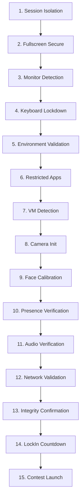

# AMS Access — Technical Repository Overview

`ams-access` is the **cross-platform desktop security shell (lockdown browser)** for the AMS (Algorithms-Mathematics-Society) contest and assessment platform. Designed using **Tauri** and **Rust** on the native backend, it wraps a high-fidelity **Next.js 15** frontend web interface inside a secure webview. The primary objective of the shell is to enforce full exam/contest lockdown to prevent academic dishonesty and technical exploitation during high-stakes competitive programming and assessments (such as the AMS Derive competition).

---

## 📌 Broader System Context

The overall AMS platform consists of four repositories:
1. **`ams-access` (This Repository):** Cross-platform desktop application wrapping the contestant client and implementing low-level OS lockdown.
2. **`contest-platform` (External):** The backend services, containing the Go API, auth/session validation, contest/question APIs, submission pipeline, audit logging, object-storage upload flows, and judging workers.
3. **`contest-web` (External):** The browser-based contestant/admin dashboard. The admin side owns contest setup and problem authoring, including Polygon/Codeforces-style problem assets such as statements, testcases, validators, generators, checkers, and local tester tooling.
4. **`infra` (External):** Provisioning and deployment for the backend and web surfaces. The near-term backend may remain on Vercel while the target platform is Google Cloud Platform (GCP), taking advantage of free credits for Cloud Run, Cloud SQL/Postgres-compatible storage, Cloud Storage buckets, Pub/Sub or Cloud Tasks, worker services, Secret Manager, and logging.

Current platform direction as of 2026-05-27:

- `contest-web` is the source of truth for admin workflows and problem setup.
- Problems/questions created in the web admin dashboard should sync into `ams-access` through backend APIs; the desktop shell should not own authoring.
- `ams-access` should remain backend-provider agnostic. It should depend on stable API contracts, signed upload URLs, and configured environment variables rather than AWS/GCP-specific assumptions.
- Object storage is expected for screenshots, submissions, testcase assets, logs, diagnostics, and proctoring artifacts. In the GCP target this maps to Cloud Storage buckets.
- Submission judging should be modeled as a queued worker pipeline. The Go backend can use goroutines inside API/worker services, but durable work should flow through a queue such as Pub/Sub or Cloud Tasks so crashes do not lose submissions.

---

## 📂 Monorepo Architecture & Directory Layout

The workspace is organized as a Turborepo-managed JS monorepo combined with a Cargo workspace for Rust packages:

```
ams-access/
├── apps/
│   ├── desktop/             # Tauri Desktop Application
│   │   └── src-tauri/       # Native Rust Entrypoint (Tauri configuration & commands)
│   └── web/                 # Next.js 15 (App Router) Contestant Client Frontend
├── packages/
│   ├── api-client/          # JS wrapper bridging Next.js to Tauri invoke() commands
│   ├── shared-ui/           # Shared React UI components (shared with contest-web)
│   ├── core-rs/             # OS-agnostic Rust core (owns the 15-stage onboarding state machine)
│   └── platform-rs/         # OS-specific Rust modules (Linux/Windows/macOS) for low-level lockdown
└── artifacts/               # Generated reports, documentation, and design assets
```

---

## 🛡️ Low-Level OS Lockdown Systems (`platform-rs`)

Low-level OS operations are separated compile-time via `cfg_if!` directives to ensure that builds remain clean across target operating systems.

### 🐧 Linux (X11 / Wayland & GNOME)
* **GSettings Keybinding Intercept:** During an active exam, the shell overrides mutter and GNOME keybindings to disable common shortcuts:
  * System keys: `Super` (Windows key), `Alt+Tab`, `Alt+F4`, `Ctrl+Esc`, and workspace switching.
  * Screenshots & screen recorders: Blocks GNOME screenshotting tools.
* **Crash Recovery:** A state file `/tmp/ams_access_kb_backup` stores original keyboard configurations. If the application crashes or exits unexpectedly, a startup hook (`recover_keyboard_if_crashed()`) reads this backup and restores the user's desktop environment safely.
* **Security & Sandboxing Checks:** Reads `/proc` to scan for prohibited background applications (Discord, OBS, Wireshark, etc.), verifies ptrace scope (yama debugger prevention), and detects `LD_PRELOAD` library injection.
* **Virtualization Detection:** Audits CPU info hypervisor vendor strings, DMI paths (`/sys/class/dmi/id/product_name`), `/proc/1/environ` container markers, and invokes `systemd-detect-virt`.
* **Outbound Firewall Lock:** Automatically creates a custom `AMS_PROCTOR` chain inside `iptables` to restrict outbound internet access exclusively to resolved IP addresses of whitelisted domains (allowing communication only with the core API and CDN).

### 🪟 Windows (Win32 API)
* **Low-Level Keyboard Hook:** Spawns a dedicated hook thread utilizing `SetWindowsHookExW` (`WH_KEYBOARD_LL`) to capture and suppress system-wide shortcut combinations:
  * Blocked keys: `Left/Right Win`, `PrintScreen`, `Alt+Tab`, `Alt+F4`, `Ctrl+Esc`, and `Escape`.
* **Sleep Prevention:** Leverages `SetThreadExecutionState` (`ES_CONTINUOUS | ES_DISPLAY_REQUIRED | ES_SYSTEM_REQUIRED`) to keep screens and machines awake.
* **Process Monitor:** Uses `tasklist /FO CSV` parsing to identify and terminate blacklisted software.
* **Virtualization Detection:** Queries registry paths (`HKLM\SOFTWARE\Microsoft\Virtual Machine\Guest\Parameters`) and parses the output of `systeminfo`.
* **Outbound Firewall Lock:** Automatically modifies Windows Defender Firewall via `netsh advfirewall` calls:
  * Sets the default outbound policy to block (`blockoutbound`).
  * Inserts high-priority `AMS_PROCTOR_ALLOW` rules for the resolved IPs of allowed hosts.
  * Restores normal firewall policies upon successful teardown or window destruction.

---

## 📊 The 15-Stage Onboarding & Verification Pipeline

In `packages/core-rs/src/exam/mod.rs`, the state machine `ExamSession` guides contestants through a strict, animated 15-stage checklist in the UI (`/session/onboarding`) before unlocking the contest:



1. **SessionIsolation:** Verifies application is running natively in a dedicated container or process space.
2. **FullscreenSecure:** Activates always-on-top mode and enforces full window boundaries.
3. **MonitorDetection:** Scans display adapters to ensure no secondary displays or virtual frames are active.
4. **KeyboardLockdown:** Hooks and locks low-level keyboard controllers.
5. **EnvironmentValidation:** Analyzes operating system safety metrics (e.g., display server types, library overrides).
6. **RestrictedApps:** Scans processes to ensure the computer is clear of communication tools, cheats, and screen grabbers.
7. **VmDetection:** Conducts timing, CPUID, and hardware-vendor checks to verify a physical bare-metal host.
8. **CameraInit:** Starts the local webcam capture layer.
9. **FaceCalibration:** Performs keypoint alignment checking.
10. **PresenceVerification:** Employs `@mediapipe/tasks-vision` and `@tensorflow-models/blazeface` models to verify the contestant is centered.
11. **AudioVerification:** Listens for background noise levels.
12. **NetworkValidation:** Measures TCP round-trip latency and stability checks to host:443.
13. **IntegrityConfirmation:** Validates overall security score and verifies session authentication.
14. **LockInCountdown:** Executes a final cinematic timer.
15. **ContestLaunch:** Launches the full contest arena dashboard inside `/session/contest`.

---

## 🎨 Premium Visual Identity & Vibe

The user interface follows a highly refined, premium "cyberpunk/brutalist" security software aesthetic:
* ** armonious Palette:**
  * Backgrounds: Dark Space Blue (`#030816`), Card Panels (`#071124`), Secondary Surfaces (`#0C1830`).
  * Violet Accent: Purple Glow (`#A855F7`), Highlights (`#C084FC`), Deep Brand Purple (`#7E22CE`).
  * Indicators: Calm Green (`#22C55E`), Caution Amber (`#F59E0B`), Threat Red (`#EF4444`).
* **Ambient Lighting:** Curated radial gradients and glowing borders (`0 0 20px rgba(168,85,247,0.18)`).
* **Cinematic Transitions:** All UI updates, checklist transitions, and buttons utilize slow, weighty, ease-out cubic-bezier easing (`cubic-bezier(0.22, 1, 0.36, 1)`) ranging from 220–450ms. No bouncy, cartoon-like animations.
* **Proctoring Frame:** Designed to look like a premium military-grade heads-up display (HUD). Camera borders use soft violet alignments brackets instead of aggressive diagnostic graphics, ensuring a premium feel of "system alignment" rather than raw surveillance.

---

## 🛠️ Monorepo Dev Workflow & Commands

All workspace operations are run from the project root using `pnpm` and `cargo`:

| Command | Action |
| :--- | :--- |
| `pnpm dev` | Starts Next.js and Tauri in development hot-reload mode simultaneously |
| `pnpm build` | Compiles Rust crates and Next.js static files (`apps/web/out`) in order |
| `pnpm lint` | Performs type checks and ESLint operations across all JS/TS codebases |
| `pnpm typecheck` | Audits TypeScript code for strict structural errors without code generation |
| `pnpm clean` | Wipes build targets, temporary files, and `node_modules` completely |
| `cargo check --workspace` | Verifies compile status of Rust packages |
| `cargo clippy --workspace` | Runs strict lints (`-D warnings` enforced by Git pre-commit hooks) |
| `cargo fmt --all` | Enforces unified formatting across all Rust source files |

---

## 📈 Implementation Status

### ✅ Fully Implemented
- [x] **Monorepo setup:** Inter-package dependencies (`@ams/shared-ui`, `@ams/api-client`) wired through Turborepo.
- [x] **Linux Lockdown:** `/proc` scanning, virtualization checks, GNOME compositor GSettings shortcut intercepts with robust `/tmp/` crash recovery, `iptables` dynamic firewalling.
- [x] **Windows Lockdown:** Low-level keyboard suppression thread hook (`SetWindowsHookExW`), `tasklist` process analysis, sleep prevention API, `netsh advfirewall` policies.
- [x] **State Machine:** 15-stage `ExamSession` validation architecture in `core-rs`.
- [x] **UI & Onboarding:** Fully responsive auth dashboards, 15-stage animated onboarding screens, integrated client-side camera alignments utilizing MediaPipe BlazeFace fallback frameworks.

### ⏳ Planned / Stubbed (Future Phases)
- [ ] **macOS Support:** `CGEventTap` keyboard interceptors, Accessibility API audits, and system profiling hooks.
- [ ] **Auth Token Hardening:** Cryptographic session tokens bound to local hardware profiles (CPU ID, MAC signature) to prevent session spoofing (Phase 2).
- [ ] **Violation Backend Sync:** Uploading local violation lists (currently preserved in-memory using `OnceLock<Mutex<Vec<ViolationEntry>>>`) to the centralized Go backend immediately upon detection (Phase 2).
- [ ] **Webcam Frame Archiving:** Direct background capturing of proctor webcam frames every 30s uploaded through signed object-storage URLs, likely Google Cloud Storage in the current GCP target (Phase 3).
